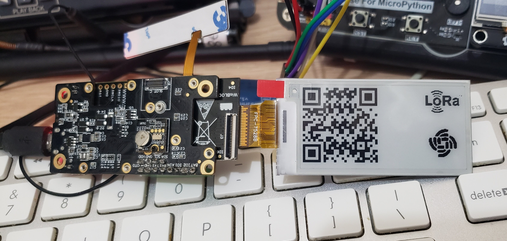

# RAK14000 QR Code

A small demo showing how to display a QR Code on a [RAK14000 e-paper display](https://store.rakwireless.com/collections/wisblock-display/products/wisblock-epd-module-rak14000), with a [WisBlock RAK4631 board](https://store.rakwireless.com/collections/wisblock-core/products/rak4631-lpwan-node).

This uses the old but reliable [QRCode libray by ricmoo](https://github.com/ricmoo/qrcode/).

